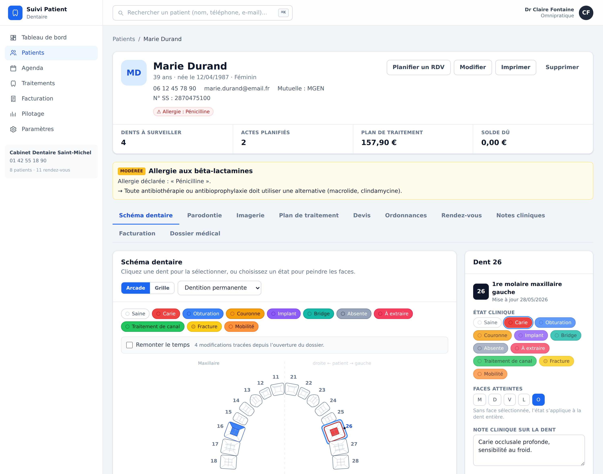
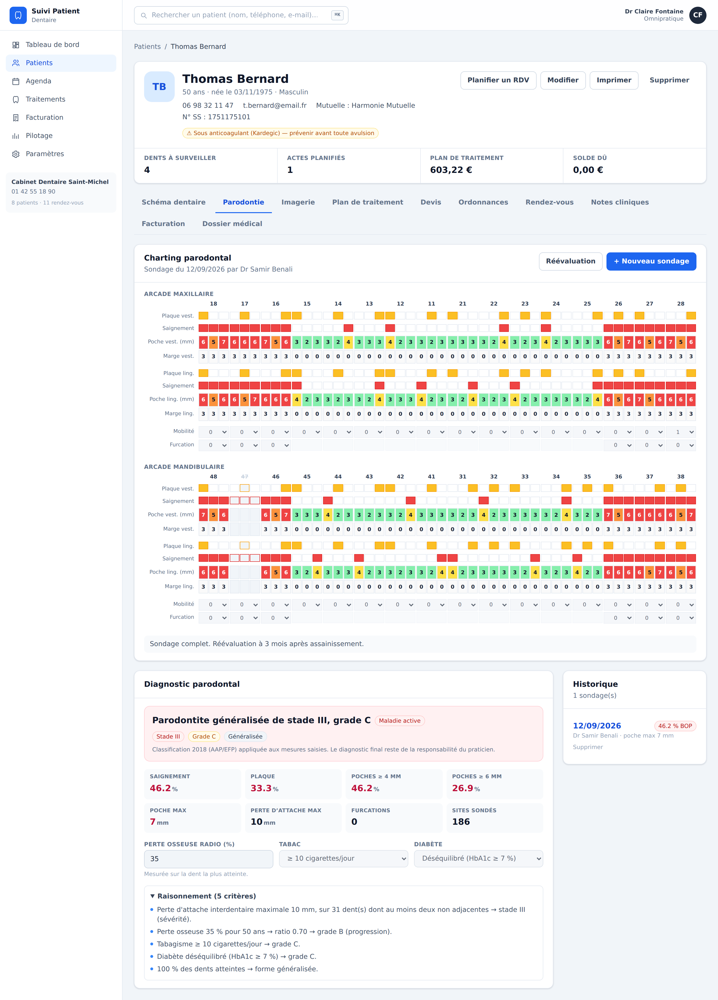
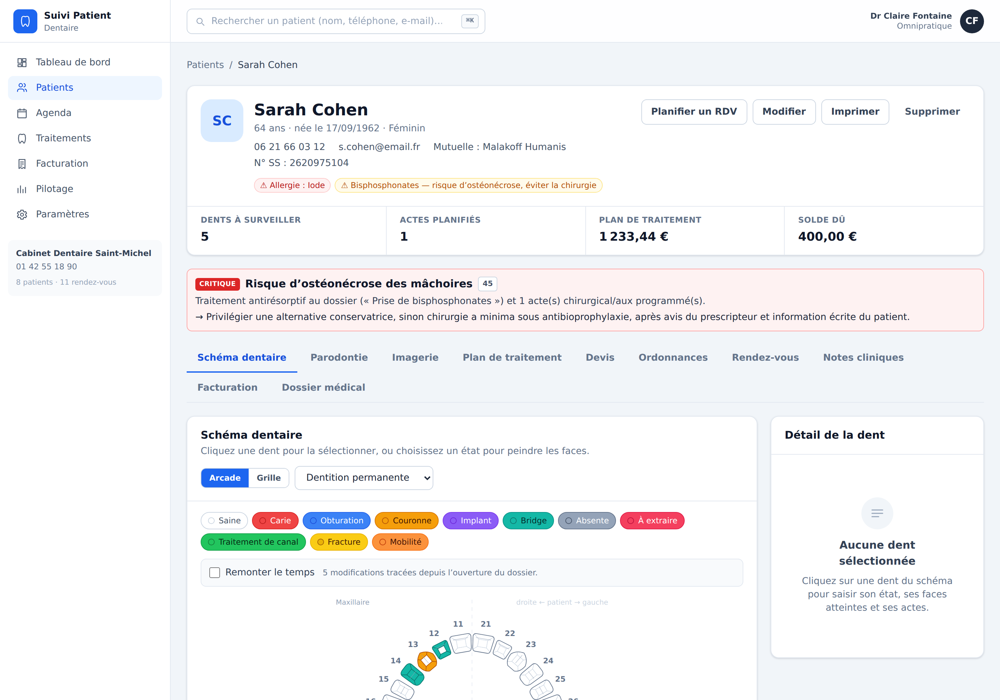
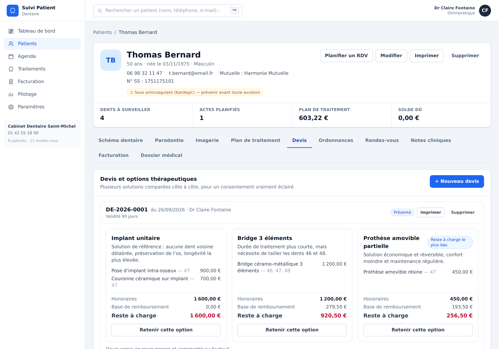
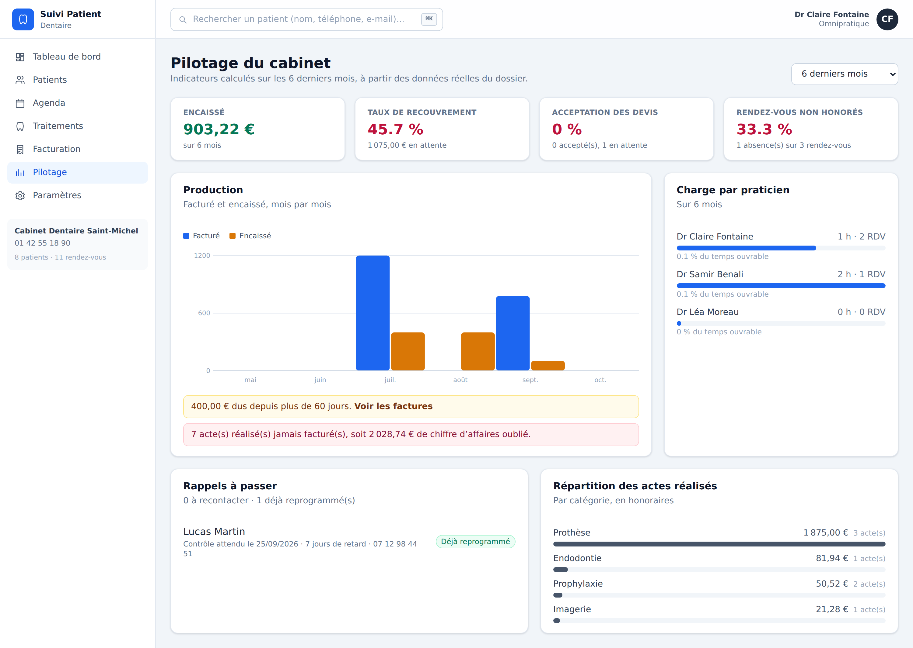
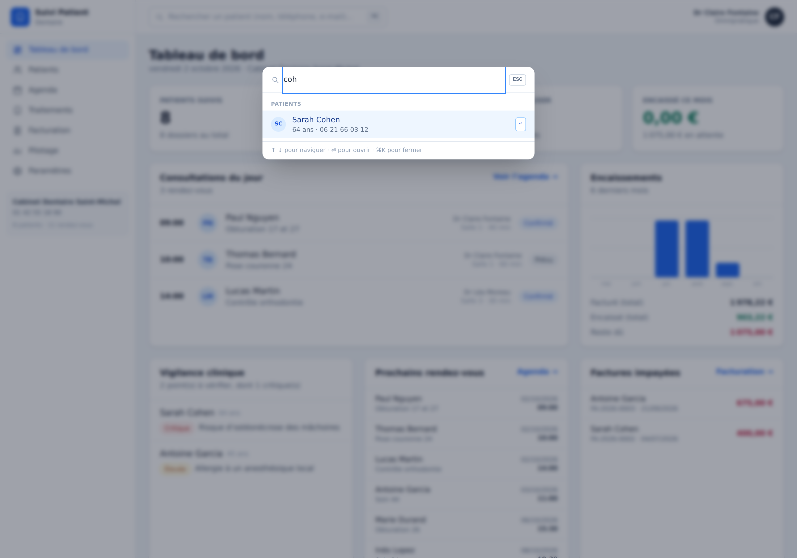

# Suivi Patient Dentaire

Logiciel de cabinet dentaire : **odontogramme anatomique**, **charting parodontal avec diagnostic
automatique**, imagerie, aide à la décision clinique, plans de traitement, agenda, facturation et
pilotage. Interface en français, fonctionnement **hors ligne**, données **chiffrées sur le poste**.



---

## Ce qui distingue cette application

|                                       |                                                                                                                         |
| ------------------------------------- | ----------------------------------------------------------------------------------------------------------------------- |
| **Odontogramme anatomique**           | Les couronnes ne sont pas des cases : chacune est dessinée à ses dimensions réelles et posée sur la courbe de l'arcade. |
| **Diagnostic parodontal automatique** | Sondage à six sites par dent, stade et grade selon la classification 2018, avec le raisonnement affiché.                |
| **Journal inviolable**                | Chaque modification est tracée. Le schéma dentaire se rejoue à n'importe quelle date, et chaque dent a sa biographie.   |
| **Aide à la décision explicable**     | Des règles déterministes croisent traitements, allergies et actes programmés. Jamais de boîte noire.                    |
| **Chiffré au repos**                  | AES-256-GCM, clé dérivée de la phrase secrète du cabinet. Sans elle, le disque est illisible.                           |
| **Hors ligne et installable**         | Aucune dépendance réseau à l'exécution. S'installe comme une application.                                               |

---

## Modules

### Odontogramme anatomique



- Numérotation **FDI / ISO 3950** : 32 dents permanentes, 20 temporaires.
- Chaque couronne est dessinée à ses **dimensions anatomiques moyennes** (diamètres mésio-distal et
  vestibulo-lingual réels, maxillaire et mandibule distincts) et posée par **longueur d'arc cumulée**
  sur une ellipse mise à l'échelle : l'espacement est anatomique et chaque dent pivote avec la
  tangente de l'arcade. Arcade maxillaire ovoïde, mandibulaire plus étroite et parabolique.
- Silhouettes par type de dent (incisive aplatie, canine cuspidée, prémolaire ovale, molaire
  quadrangulaire) et sillons occlusaux.
- Saisie **par face** (mésiale, distale, vestibulaire, linguale/palatine, occlusale) avec orientation
  anatomique garantie quelle que soit la rotation : le vestibulaire pointe toujours vers l'extérieur
  de l'arcade, le mésial vers la ligne médiane. Les dents antérieures n'exposent pas de face occlusale.
- 11 états cliniques, **mode peinture** (choisir un état puis cliquer les faces), note par dent.
- **Vue grille** disponible d'un clic : plus rapide à saisir au fauteuil.
- **Garde-fou de dentition** : une dent relevée hors de la dentition affichée est signalée au lieu de
  disparaître silencieusement.

### Parodontologie

- Sondage complet : **six sites par dent** — profondeur de poche, marge gingivale, saignement, plaque,
  suppuration — plus mobilité et furcation (proposée uniquement sur les pluriradiculées).
- **Saisie en rafale** : le curseur avance seul après chaque profondeur. `S` saignement, `P` plaque,
  `U` suppuration, flèches pour naviguer. Profondeurs colorées du vert au rouge sombre.
- Indices automatiques : saignement, plaque, poches ≥ 4 et ≥ 6 mm, poche maximale, perte d'attache,
  furcations, sites sondés.
- **Classification 2018 (AAP/EFP)** : stade I-IV, grade A-C, étendue, stabilité — avec la liste des
  critères retenus. Le praticien voit le raisonnement et garde la décision.
- Comparaison avec le sondage précédent et réévaluation en un clic.

La perte d'attache retenue pour la stadification **distingue le sulcus physiologique d'une vraie
perte** : un parodonte sain n'est pas classé à tort en parodontite. La définition de cas exige deux
dents **non adjacentes**, et les dents absentes sont exclues des indices.

### Aide à la décision clinique



Des règles déterministes, chacune motivée par la donnée qui l'a déclenchée :

- **Sécurité** — risque hémorragique (anticoagulant croisé avec un geste sanglant), ostéonécrose des
  mâchoires (antirésorptif croisé avec une chirurgie), antibioprophylaxie de l'endocardite, conflits
  d'allergie (anesthésiques, bêta-lactamines, latex), grossesse, diabète déséquilibré avant
  chirurgie, tabac avant implant.
- **Clinique** — carie relevée sans acte programmé, dent à extraire sans avulsion inscrite, dent
  postérieure dépulpée sans coiffe prévue, contrôle dépassé.
- **Profils de risque** — risque carieux dans l'esprit de CAMBRA, risque parodontal à six vecteurs
  (saignement, poches résiduelles, perte osseuse rapportée à l'âge, dents absentes, tabac, terrain
  systémique), et **intervalle de rappel conseillé** retenant le plus court des deux.

Le tableau de bord agrège la vigilance sur l'ensemble du cabinet.

### Journal, remontée temporelle et biographie de la dent

- Chaque mutation écrit un événement **horodaté, signé par le praticien actif, avec l'état avant et
  après**. Le journal n'est ni modifié ni purgé.
- **Curseur de temps** : la bouche est reconstituée telle qu'elle était à chaque date, en lecture
  seule, à partir des seuls événements du journal.
- **Biographie par dent** : toute la vie d'une dent — états, actes, notes — avec auteur et horodatage.

### Imagerie

- Import par glisser-déposer, typé (rétro-alvéolaire, bitewing, panoramique, cone beam, photo) et
  rattaché aux dents concernées.
- Binaires dans **IndexedDB**, vignettes compressées à l'import.
- **Chiffrés avec la clé du coffre** quand il est actif : une radio récupérée sur le disque sans la
  phrase secrète reste illisible.
- Visionneuse : zoom, négatif, contraste, annotations posées au clic.

### Devis à variantes



- Plusieurs solutions thérapeutiques **présentées côte à côte**, avec honoraires, base de
  remboursement et reste à charge, et mise en évidence de l'option la moins coûteuse.
- Comparateur imprimable, remis au patient pour un consentement éclairé.
- Décision tracée (acceptation, refus, prolongation, expiration), et l'option retenue **se transforme
  en actes du plan de traitement** en un clic.

### Plans de traitement, agenda, facturation

- Catalogue de 23 actes inspirés de la **CCAM** : codes, honoraires, base de remboursement, durée.
- Actes rattachés aux dents et aux faces, organisés par séance ; totaux et reste à charge.
- Agenda en grille horaire et en liste, création par clic sur un créneau, **détection des conflits**
  par praticien, filtrage, couleurs de praticien.
- Facturation des actes réalisés, numérotation annuelle séquentielle, règlements multiples, statut
  déduit des encaissements, facture imprimable seule.
- Ordonnances : sept modèles odontologiques, **désactivés quand une allergie du dossier les
  contre-indique**, imprimables avec en-tête et signature.

### Pilotage du cabinet



Encaissements, taux de recouvrement, **taux d'acceptation des devis** (en nombre et en valeur, calculé
sur les seuls devis décidés), taux de rendez-vous non honorés, charge par praticien, répartition des
actes, **actes réalisés jamais facturés**, et **moteur de rappels** listant les patients à recontacter
— les patients déjà reprogrammés étant écartés.

### Palette de commandes



`⌘K` / `Ctrl+K` ouvre n'importe quel dossier, écran ou action sans quitter le clavier, avec recherche
insensible aux accents sur nom, téléphone, e-mail, numéro de sécurité sociale et mutuelle.

---

## Sécurité et confidentialité

Les données ne quittent jamais le poste : **aucun serveur, aucun envoi réseau, aucune dépendance CDN**.

Le coffre, activable dans les paramètres, chiffre l'intégralité du magasin :

- **AES-256-GCM**, clé dérivée par **PBKDF2-SHA-256, 310 000 itérations**, sel aléatoire de 16 octets,
  IV distinct à chaque scellement.
- La clé vit en mémoire et **n'est jamais persistée** : fermer l'onglet referme le coffre.
- Verrouillage manuel ou automatique après inactivité.
- Les images sont chiffrées avec la même clé.

**La phrase secrète n'est stockée nulle part. Perdue, les données sont irrécupérables.** Exportez une
sauvegarde avant d'activer le coffre.

> Cette application n'est pas un dispositif médical et n'intègre pas d'authentification multi-postes.
> Avant tout usage sur des données de santé réelles, prévoyez l'hébergement et les mesures exigés par
> la réglementation applicable (en France, hébergement de données de santé et RGPD). Les règles d'aide
> à la décision sont une assistance, jamais une prescription : le praticien reste seul responsable.

---

## Démarrage

```bash
npm install
npm run dev        # http://localhost:5173
```

Au premier lancement, un cabinet de démonstration complet est chargé — 8 patients, schémas dentaires
renseignés, sondages parodontaux, actes, rendez-vous, factures, devis et journal historique — pour que
chaque écran soit immédiatement utilisable. Remplaçable ou effaçable depuis **Paramètres → Données**.

```bash
npm run build      # build de production + précache du service worker
npm run preview    # sert le build de production
npm run test       # 155 tests (Vitest)
npm run lint       # vérification TypeScript
```

---

## Architecture

```
src/
  components/
    OdontogrammeArcade.tsx   Arcade anatomique (pose, rotation, faces cliquables)
    DentalChart.tsx          Vue grille
    ToothPanel.tsx           Dent sélectionnée + biographie
    perio/                   Grille de sondage, panneau de diagnostic, onglet
    OngletImagerie.tsx       Import, galerie, visionneuse annotable
    OngletDevis.tsx          Devis à variantes et comparateur
    OngletOrdonnances.tsx    Modèles de prescription
    PanneauAlertes.tsx       Aide à la décision
    PanneauRisques.tsx       Profils de risque carieux et parodontal
    PaletteCommandes.tsx     ⌘K
    EcranVerrouillage.tsx    Déverrouillage du coffre
    ui/                      Primitives (Button, Card, Modal, Field, Badge…)
  pages/                     Dashboard, Patients, PatientDetail, Agenda,
                             Traitements, Facturation, Pilotage, Parametres
  data/
    teeth.ts                 Numérotation FDI, anatomie, états cliniques
    anatomie.ts              Dimensions coronaires, pose sur l'arcade, silhouettes
    perio.ts                 Mesures, indices, classification 2018
    actes.ts                 Catalogue CCAM
    medicaments.ts           Modèles d'ordonnance et contre-indications
    seed.ts                  Jeu de démonstration
  lib/
    crypto.ts                Coffre AES-GCM / PBKDF2
    storage.ts               Persistance, migrations, export/import
    imagerie.ts              IndexedDB, vignettes, chiffrement des binaires
    decision.ts              Règles cliniques et profils de risque
    historique.ts            Rejeu du journal, biographie, activité
    finance.ts               Totaux, statuts, numérotation
    pilotage.ts              Indicateurs et moteur de rappels
  store/AppContext.tsx       État applicatif, journalisation, coffre
  types/                     Modèle de domaine typé
```

**Pile technique** : React 18, TypeScript strict, Vite, Tailwind CSS, React Router, Vitest +
Testing Library. Aucune dépendance réseau à l'exécution — polices système, pas de CDN.

### Stockage

Dossier dans `localStorage` (clé `suivi-patient-dentaire:v1`), images dans IndexedDB, chiffrés quand
le coffre est actif. Les sauvegardes v1 sont **migrées automatiquement** en v2.

Pour un usage multi-postes, `src/lib/storage.ts` est le seul module à réécrire : tout le reste passe
par le magasin `src/store/AppContext.tsx`.

---

## Tests

155 tests couvrent :

- la numérotation FDI, l'anatomie et la **géométrie de l'arcade** (symétrie, non-chevauchement,
  courbure, boîte englobante) ;
- les **mesures et la classification parodontales** — sulcus sain contre perte d'attache, adjacence,
  seuils de stade et de grade, exclusion des dents absentes ;
- les **règles de décision** — déclenchement, non-déclenchement, tri par gravité, seuils de risque ;
- le **rejeu du journal** — remontée temporelle, cloisonnement entre patients, journal désordonné,
  cohérence entre rejeu et schéma courant ;
- le **chiffrement** — aller-retour, refus de phrase incorrecte, sel et IV distincts, images
  illisibles sans clé ;
- la **facturation et le pilotage** — totaux, statuts, numérotation annuelle, ventilation mensuelle,
  taux, rappels ;
- la persistance, les migrations v1 → v2, et des **parcours applicatifs de bout en bout**.

```bash
npm run test
```

---

## Limites connues

- **Denture mixte** : le schéma bascule entre denture permanente et temporaire ; il n'affiche pas
  les deux simultanément. Un enfant en denture mixte se chartre en basculant, et l'application
  signale les dents relevées hors de la vue courante plutôt que de les masquer.
- **Thème sombre** : non fourni. Les couleurs d'état dentaire et d'alerte portent un sens clinique
  qu'un thème sombre devrait redériver entièrement ; un thème à moitié traité serait un risque de
  lecture, pas un confort.
- **Monoposte** : pas de synchronisation entre postes ni de comptes utilisateurs. Le praticien actif
  signe le journal mais n'est pas authentifié.
