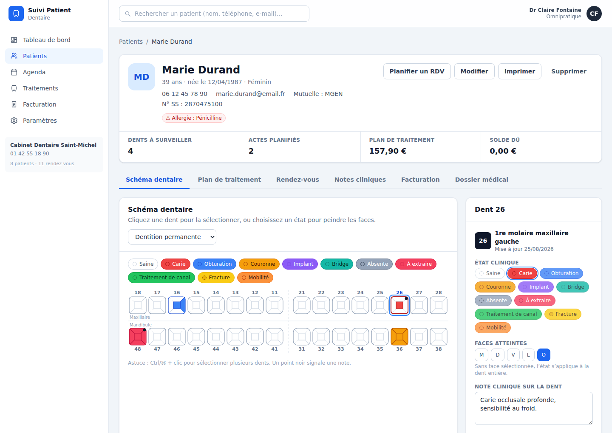

# Suivi Patient Dentaire

Application de gestion de cabinet dentaire : **schéma dentaire interactif**, dossiers patients,
plans de traitement, agenda et facturation. Interface en français, entièrement opérationnelle
hors ligne — aucune donnée ne quitte le poste.



## Fonctionnalités

### Schéma dentaire interactif (odontogramme)
- Numérotation **FDI / ISO 3950** complète : 32 dents permanentes et 20 dents temporaires.
- Sélection d’une dent au clic, sélection multiple avec `Ctrl`/`⌘` + clic.
- Saisie **par face** (mésiale, distale, vestibulaire, linguale/palatine, occlusale), avec
  orientation anatomiquement correcte : le vestibulaire pointe vers l’extérieur de l’arcade,
  le mésial vers la ligne médiane. Les dents antérieures n’exposent pas de face occlusale.
- 11 états cliniques : saine, carie, obturation, couronne, implant, bridge, absente, à extraire,
  traitement de canal, fracture, mobilité.
- **Mode peinture** : choisir un état dans la légende puis cliquer directement les faces.
- Note clinique par dent, signalée par une pastille sur le schéma.
- Bascule dentition permanente / temporaire par patient (automatique pour les jeunes enfants).

### Dossiers patients
- Fiche complète : état civil, contact, n° de sécurité sociale, mutuelle, médecin traitant.
- Dossier médical : allergies, antécédents, traitements en cours, **alertes** mises en évidence
  en tête de fiche et sur le tableau de bord (anticoagulants, bisphosphonates, allergies…).
- Recherche instantanée insensible aux accents et à la casse (nom, téléphone, e-mail, n° SS).
- Notes cliniques horodatées et catégorisées (consultation, soin, urgence, contrôle, administratif).
- Impression de la fiche patient.

### Plans de traitement
- Catalogue de 23 actes inspirés de la **CCAM** (codes, honoraires, base de remboursement, durée).
- Actes rattachés à une ou plusieurs dents et à des faces précises, organisés par séance.
- Statuts : planifié, en cours, réalisé, annulé — avec passage en « réalisé » en un clic.
- Totaux automatiques : honoraires, base remboursable, **reste à charge estimé**.
- Vue transversale « Traitements » : filtres par statut, catégorie, praticien et recherche libre.

### Agenda
- Vue semaine en grille horaire (8 h – 20 h) et vue liste.
- Création d’un rendez-vous par clic sur un créneau libre.
- **Détection des conflits** : refus d’un créneau déjà occupé par le même praticien.
- Filtrage par praticien, couleur de praticien sur chaque rendez-vous.
- Statuts : prévu, confirmé, en salle, terminé, annulé, absent.

### Facturation
- Facturation directe des actes réalisés depuis le plan de traitement, ou saisie manuelle.
- Numérotation séquentielle annuelle (`FA-2026-0001`).
- Règlements multiples par facture (carte, espèces, chèque, virement, mutuelle) ; le statut
  (émise / partielle / payée) se déduit automatiquement des encaissements.
- Facture imprimable seule, en-tête du cabinet et coordonnées du patient.
- Suivi du total facturé, encaissé et du reste dû, avec encaissements des 6 derniers mois.

### Paramètres et données
- Identité du cabinet (reprise sur les factures), devise, durée de rendez-vous par défaut.
- Gestion des praticiens (nom, spécialité, couleur d’agenda).
- **Export / import JSON** de la totalité des données, rechargement du jeu de démonstration,
  effacement complet.

## Démarrage

```bash
npm install
npm run dev        # http://localhost:5173
```

Au premier lancement, un cabinet de démonstration complet est chargé (8 patients, schémas
dentaires renseignés, actes, rendez-vous, factures et notes) pour que chaque écran soit
immédiatement utilisable. Il est remplaçable ou effaçable depuis **Paramètres → Données**.

### Autres commandes

```bash
npm run build      # build de production dans dist/
npm run preview    # sert le build de production
npm run test       # suite de tests (Vitest)
npm run lint       # vérification TypeScript
```

## Stockage des données

Les données sont conservées dans le `localStorage` du navigateur, sous la clé
`suivi-patient-dentaire:v1`. Elles restent donc sur le poste : aucun serveur, aucun envoi réseau,
fonctionnement complet hors ligne.

**Conséquences pratiques :** les données sont propres à un navigateur et à un poste. Pour un usage
multi-postes, exportez régulièrement la sauvegarde (Paramètres → Données), ou remplacez
`src/lib/storage.ts` par des appels à votre propre API — c’est le seul module à réécrire, le reste
de l’application passe par le magasin `src/store/AppContext.tsx`.

Cette application n’est pas un dispositif médical et n’intègre ni authentification ni chiffrement :
avant tout usage sur des données de santé réelles, prévoyez l’hébergement et les mesures de
sécurité exigés par la réglementation applicable (en France, hébergement de données de santé
et RGPD).

## Architecture

```
src/
  components/        Composants d’interface
    DentalChart.tsx  Odontogramme SVG interactif (zones cliquables par face)
    ToothPanel.tsx   Panneau de saisie de la dent sélectionnée
    PatientForm.tsx  ActeForm.tsx  RdvForm.tsx  Formulaires de saisie
    Layout.tsx       Navigation, recherche globale
    ui/              Primitives (Button, Card, Modal, Field, Badge…)
  pages/             Dashboard, Patients, PatientDetail, Agenda, Traitements,
                     Facturation, Parametres
  data/
    teeth.ts         Numérotation FDI, anatomie, états cliniques
    actes.ts         Catalogue d’actes CCAM
    seed.ts          Jeu de démonstration
  lib/
    storage.ts       Persistance locale, export/import
    finance.ts       Totaux, statuts de facture, numérotation
    utils.ts         Dates, montants, recherche
  store/
    AppContext.tsx   État applicatif et actions (source de vérité unique)
  types/             Modèle de domaine typé
```

**Pile technique :** React 18, TypeScript strict, Vite, Tailwind CSS, React Router, Vitest +
Testing Library. Aucune dépendance réseau à l’exécution (polices système, pas de CDN).

## Tests

34 tests couvrent la numérotation FDI et l’orientation anatomique des faces, les calculs de
facturation et de plan de traitement, les utilitaires de dates et de recherche, la persistance et
la cohérence du jeu de démonstration, ainsi que quatre parcours applicatifs de bout en bout
(navigation, ouverture d’un dossier, sélection d’une dent et modification de son état, création
d’un patient).

```bash
npm run test
```
